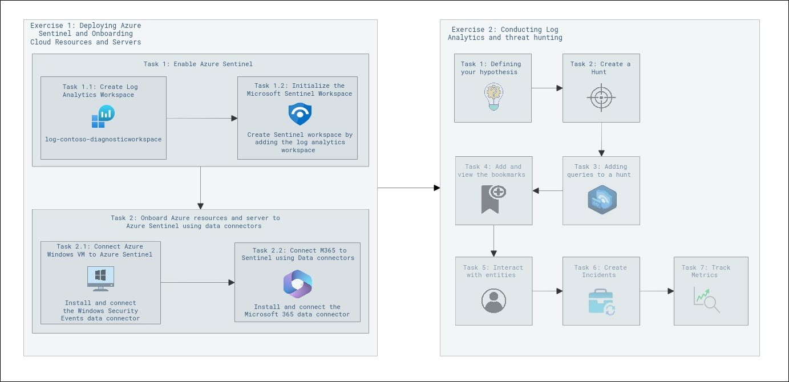
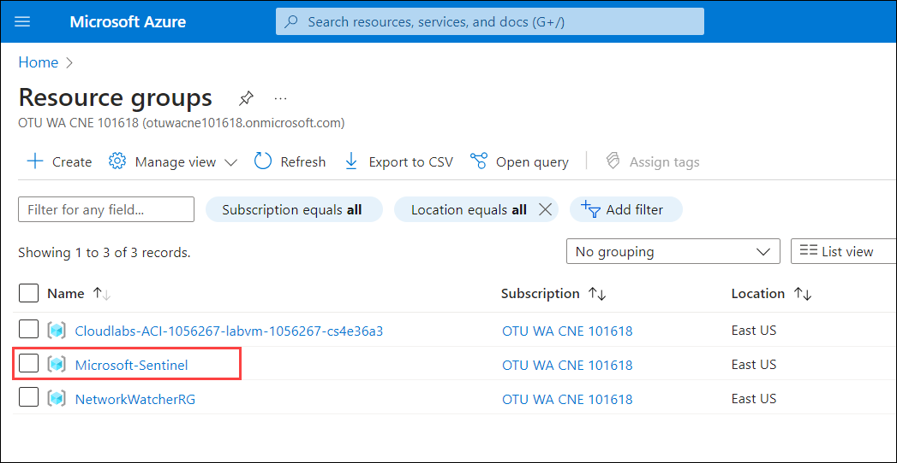
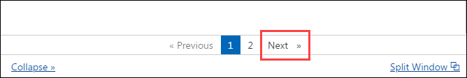

# Security Information and Event Management with Microsoft Sentinel

## Overall Estimated Duration: 4 Hours

## Overview

In this lab, you'll enable Azure Sentinel, deploy the Microsoft Sentinel Training Lab Solution, and onboard Azure resources. You'll define a hypothesis for threat hunting, create structured hunts, and use queries to analyze data. This setup enhances your skills in monitoring, detecting, and responding to security threats effectively. By engaging in these activities, you'll gain hands-on experience with Azure Sentinel, improving your ability to protect and secure your organization's IT environment.

## Objective

Understand how to deploy Azure Sentinel, configure it, and onboard cloud resources and servers. Gain skills in advanced security analytics and creating a training environment. By the end of this lab, you will be able to:

* **Deploying Azure Sentinel and Onboarding Cloud Resources and Servers**: Understand how to enable Azure Sentinel, deploy the Sentinel Training Lab Solution, and onboard Azure resources to create a robust security environment. This setup provides advanced security analytics and a training environment, enhancing your ability to monitor, detect, and respond to security threats effectively.

* **Conducting Log Analytics and Threat Hunting**: Understand how to define a hypothesis for threat hunting, create structured hunts in Microsoft Sentinel, and analyze data using queries and bookmarks. You’ll also learn to create incidents from alerts and track metrics, enhancing your threat detection and investigation skills.

## Pre-requisites

* General understanding of Security Operations
* Familiarity with networking
* Basic knowledge on log analytics

## Architecture

This architectural diagram illustrates the process of setting up and utilizing Azure Sentinel, a cloud-native security information event management (SIEM) and security orchestration automated response (SOAR) solution. It is divided into two main exercises. The first exercise focuses on onboarding Azure Sentinel, which involves creating a log analytics workspace, initializing Azure Sentinel by linking it to this workspace, and connecting various resources using data connectors. The second exercise is about conducting log analysis and threat hunting. This includes absorbing data into Azure Sentinel, connecting additional resources, and using various tools to analyze the data and hunt for potential security threats. This structured approach ensures effective security management and threat detection within a cloud environment.

## Architecture Diagram

## Explanation of Components

- **Log Analytics Workspace**: This is the foundational component where all logs and data are collected and stored for analysis.
- **Azure Sentinel Initialization**: This step involves setting up Azure Sentinel by linking it to the previously created log analytics workspace, enabling it to start monitoring and analyzing data.
- **Data Connectors**: These are used to connect various resources (like virtual machines, applications, and other services) to Azure Sentinel, allowing it to ingest data from these sources for security monitoring.
- **Threat Analysis Tools**: These tools are used to analyze the ingested data, helping security teams to hunt for and identify potential threats. This includes various analytical tools represented by icons such as graphs and magnifying glasses.

These components work together to provide a comprehensive security management solution, enabling effective monitoring, analysis, and threat detection within a cloud environment

## Accessing Your Lab Environment
 
Once you're ready to dive in, your virtual machine and lab guide will be right at your fingertips within your web browser.
 

### Virtual Machine & Lab Guide
 
Your virtual machine is your workhorse throughout the workshop. The lab guide is your roadmap to success.
 
## Exploring Your Lab Resources
 
To get a better understanding of your lab resources and credentials, navigate to the **Environment** tab.
 

 
## Utilizing the Split Window Feature
 
For convenience, you can open the lab guide in a separate window by selecting the **Split Window** button from the Top right corner.
 

 
## Managing Your Virtual Machine
 
Feel free to start, stop, or restart your virtual machine as needed from the **Resources** tab. Your experience is in your hands!
 

 
## Lab Duration Extension

1. To extend the duration of the lab, kindly click the **Hourglass** icon in the top right corner of the lab environment. 

    

    >**Note:** You will get the **Hourglass** icon when 15 minutes are remaining in the lab.

2. Click **OK** to extend your lab duration.
 
   

3. If you have not extended the duration prior to when the lab is about to end, a pop-up will appear, giving you the option to extend. Click **OK** to proceed.

## Let's Get Started with Azure Portal
 
1. On your virtual machine, click on the Azure Portal icon as shown below:
 
   

2. On the **Sign in to Microsoft Azure** tab you will see the login screen, in that enter the following email/username, and click on **Next**.
 
   - **Email/Username:** <inject key="AzureAdUserEmail"></inject>
 
     
 
3. Now enter the following password and click on **Sign in**.
 
   - **Password:** <inject key="AzureAdUserPassword"></inject>
 
     
 
1. If you see the pop-up Action Required, click Ask Later.

   

   >**NOTE:** Do not enable MFA, select **Ask Later**.
     
1. If you see the pop-up **Stay Signed in?**, select **No**.

1. If you see the pop-up **You have free Azure Advisor recommendations!**, close the window to continue the lab.

1. If a **Welcome to Microsoft Azure** popup window appears, select **Maybe Later** to skip the tour.

1. Now you will see the Azure Portal Dashboard, Click on **Resource groups** from the Navigate panel to see the resource groups.

   

1. Confirm you have a resource group named **Microsoft-Sentinel** present as shown in the below screenshot. You need to use this resource group throughout the entire process of lab execution.

   
   
1. Use the **Next** button from the lower right corner to move on to the next page.

   

> [!IMPORTANT]

*For a smoother experience during the hands-on lab, it's important to review both the instructions and the accompanying notes thoroughly. This will help you navigate through the tasks with ease and confidence.*

This hands-on lab will guide you in using Azure’s advanced tools, including OpenAI LLM, Azure AI Search, and Form Recognizer, to create intelligent systems that enhance productivity and deliver personalized experiences.

## Support Contact

The CloudLabs support team is available 24/7, 365 days a year, via email and live chat to ensure seamless assistance at any time. We offer dedicated support channels tailored specifically for both learners and instructors, ensuring that all your needs are promptly and efficiently addressed.

Learner Support Contacts:

- Email Support: labs-support@spektrasystems.com

- Live Chat Support: https://cloudlabs.ai/labs-support
  
Now, click on Next from the lower right corner to move on to the next page.

## Happy Learning!!
