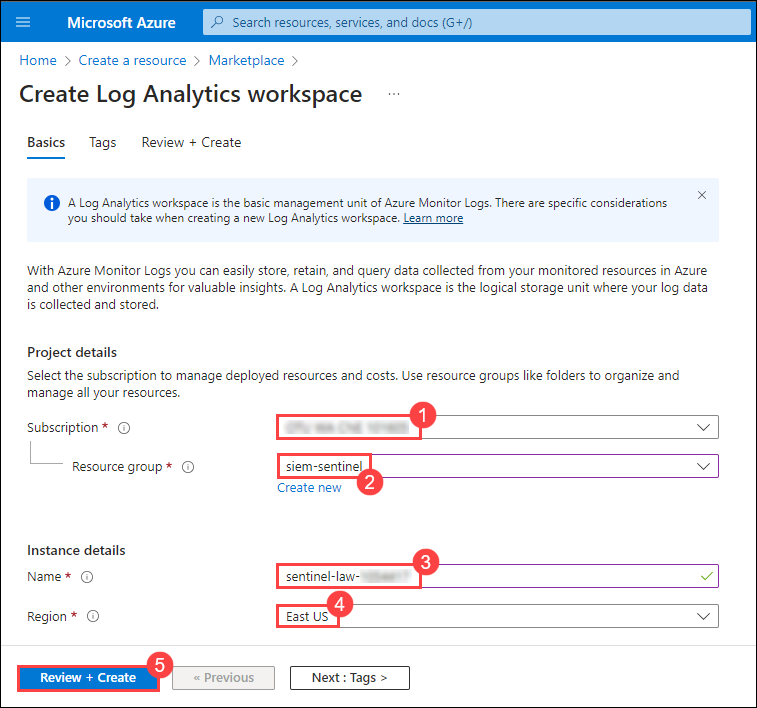
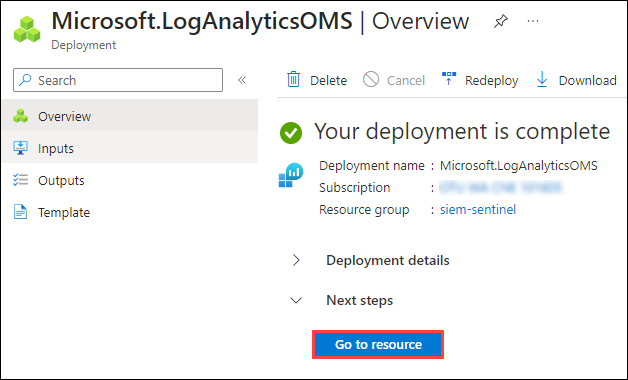

# Exercise 1: Deploying Azure Sentinel and Onboarding Cloud Resources and Servers

### Duration: 30 minutes

## Scenario 

Contoso is looking to enhance its cybersecurity posture by implementing a robust cloud-native Security Information and Event Management (SIEM) solution. After careful consideration, the decision has been made to deploy Azure Sentinel and Microsoft's cloud-native SIEM solution. As part of this initiative, you need to onboard various cloud resources and servers to Azure Sentinel for comprehensive security monitoring and threat detection.

## Overview

An Azure Virtual Network (VNet) is a network or environment that can be used to run VMs and applications in the cloud. When it is created, the services and Virtual Machines within the Azure network interact securely with each other, the internet, and on-premises networks. You can find more references about the virtual network from here: ```https://docs.microsoft.com/en-us/azure/virtual-network/```

A subnet is a range of IP addresses in the virtual network. You can divide a virtual network into multiple subnets for organization and security.

In this exercise, you will create a Virtual Network and subnets for different scenarios like AVD, DMZ, Internal, and AzureFirewallSubnet.

This exercise includes the following tasks:

* [Task 1: Enable Azure Sentinel](#task-1-provision-virtual-network)
* [Task 2: Onboard Azure resources and server to Azure Sentinel using Data connectors](#task-2-provision-subnets)

## Task 1: Enable Azure Sentinel

This task includes the creation of Log Analytics Workspace and initialization of the Microsoft Sentinel Workspace.

### Task 1.1 : Create Log Analytics Workspace

1.  In the Azure Portal, from the upper left corner select **menu (1)** icon with three lines as highlighted below and then select **+ Create a resource (2)**.

      

2. In the search box, type **Log Analytics Workspace** and select the search result.
   
      
   
3. Within the Marketplace page, search for the **Log Analytics Workspace** resource card and click on **Create (1)** >> **Log Analytics Workspace (2)**.

      

4. On the **Basics** tab of the **Create Log Analytics workspace**, enter the following details and select **Review + Create (5)**
   
      -  **Subscription (1):** Select the default assigned subscription
      -  **Resource group (2):** Select **siem-sentinel** resource group from the drop down list
      -  **Name (3):**  Enter **sentinel-law-<inject key="Deployment-id" enableCopy="false"></inject>**
      -  **Region (4):** Select **East US**

      

5. Once the workspace validation has passed, select **Create**. Wait for the new workspace to be provisioned, this may take a few minutes.
6. Soon after successful deployment of the **Microsoft.LogAnalyticsOMS**, on the overview page, click on **Go to resource** inorder to view the newly created Log Analytics Workspace.

      

### Task 1.2 : Initialize the Microsoft Sentinel Workspace

1. In the Search bar of the Azure portal, type *Sentinel* and select **Microsoft Sentinel** from the list of search results.

      

2. Within the Microsoft Sentinel home page, click on **+ Create** to create and configure the Sentinel Workspace.

      

3. On the **Add Microsoft Sentinel to a workspace** page, select the existing workspace i.e, **sentinel-law-<inject key="Deployment-id" enableCopy="false"></inject> (1)** which was created in the previous task, then select **Add (2)**. This could take a few minutes.

      

4. Navigate around the newly created Microsoft Sentinel workspace to become familiar with the user interface options.

      >**Note**: The Microsoft Sentinel is deployed with a one month free trail activation period.

## Task 2: Onboard Azure resources and server to Azure Sentinel using data connectors
