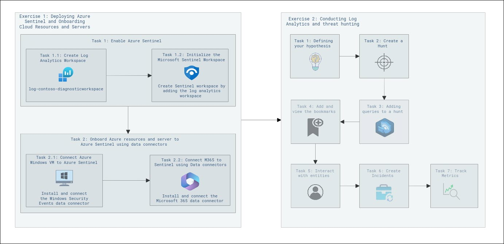

# Security Information and Event Management with Microsoft Sentinel

## Overall Estimated Duration: 4 Hours

## Overview

In this lab, you'll enable Azure Sentinel, deploy the Microsoft Sentinel Training Lab Solution, and onboard Azure resources. You'll also define a hypothesis for threat hunting, create structured hunts, and use queries to analyze data. This setup enhances your skills in monitoring, detecting, and responding to security threats effectively.

## Objective

* **Deploying Azure Sentinel and Onboarding Cloud Resources and Servers**: 
* **Conducting Log Analytics and Threat Hunting**: 

## Pre-requisites

## Architecture

## Solution Architecture

## Lab Context

In this Hands-on Lab, you will learn how to use Microsoft Sentinel to perform threat hunting by running queries to investigate your hypothesis. You will get Hands-on experience with Azure resources and how to use Microsoft Sentinel to detect attacks.

### Exercise 1: Deploying Azure Sentinel and Onboarding Cloud Resources and Servers

In this exercise, you will deploy the Log Analytics workspace and Microsoft Sentinel and also establish a connection between Windows and M365 data connectors to the Sentinel workspace.

###  Exercise 2: Conducting log analytics and Threat Hunting

In this exercise, you will define a hypothesis in Microsoft Sentinel and create hunts to detect the treats.
